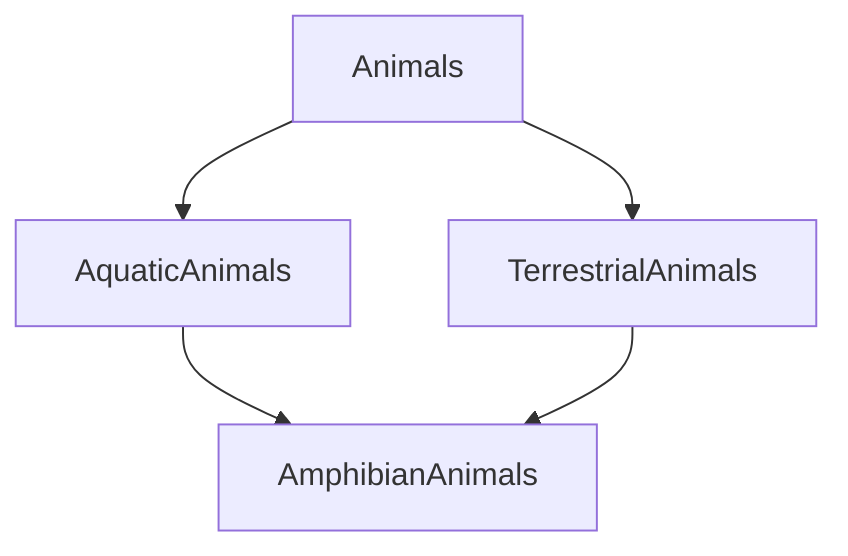

# Q1
Create necessary base and, derived classes for the following scenario. Include necessary member variables, member functions as you see fit.



- Demonstrate the use of access specifiers: public, private and protected.

- Demonstrate the use of virtual base class.

- Make the class Animals an abstract class with a pure virtual function: ``livingArea()``. Override this function in the subsequent derived classes Terrestrial Animals, Aquatic Animals and, Amphibian Animals.

- Create a base class pointer to point to derived class's objects and, demonstrate how they work.[not mendatory]


# Q2

Consider the class Complex:

```cpp
class Complex
{
private:
    int real, imag;
public:

    Complex(int r = 0, int i = 0)
    {
        real = r;
        imag = i;
    }
};
```

- Overload the ``+`` operator so that it accepts the following types of operations: ``ob + int;`` ``int + ob;``
- Overload the ``==`` operator relative to the Complex class.